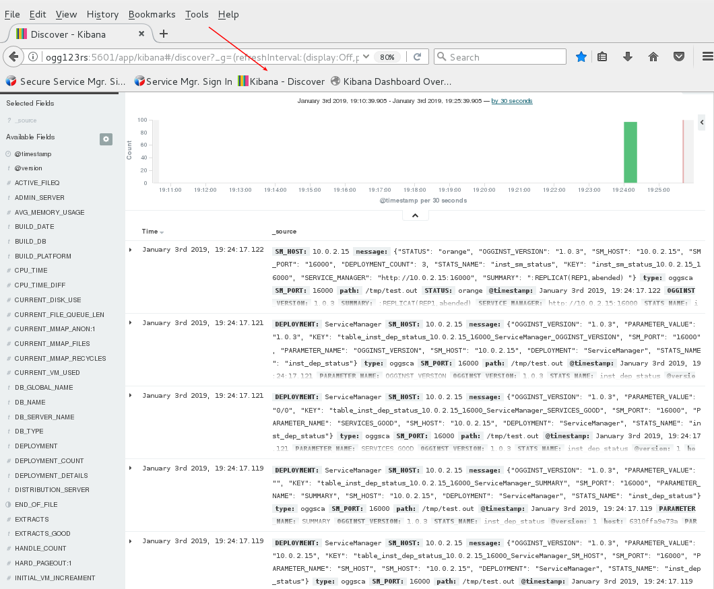

# Docker With Elk Monitoring

As noted in the readme document, labs 1 - 5 in the [Oracle_GoldenGate_12c_HOL_Current.pdf](https://dgcameron.github.io/veridata/Oracle_GoldenGate_12c_HOL_Current.pdf) from the base image have already been done for you in the .  You may wish to walk through the creation of deployments in that document.  Note that all the GG product path references (eg: /opt/app/oracle/product/12.3.0.1...) will be /opt/app/oracle/product/18.1... to reflect an upgrade to 18.1.

## **Run Docker and Elk Monitoring**

- Start the database.  Open a terminal window and enter:
    - `/home/oracle/Desktop/Scripts/startup.sh`

- Start GG services:
    - `/opt/app/oracle/gg_deployments/ServiceManager/bin/startSM.sh` (disregard the message saying the service could not be started)

- If you have completed the one way replication lab then skip this step, otherwise run the following to complete the gg configuration.
    - `/home/oracle/Desktop/api/cr_bash_config.sh`

- Start Docker.
    - `sudo systemctl start docker`

- Start firefox, log into GG, and confirm services are configured and running.


- Run swingbench and generate transactions.  See lab 6 in the HOL document for detailed steps.  Suggest entering a value of .01 as a generation factor to avoid generating a large amount of data.
    - `/opt/app/oracle/product/swingbench/bin/oewizard`

- Review replicat statistics to confirm the data has been replicated.


Run ogg-elk image. Enter the following in terminal window.
```
docker run -ti \
-p 5601:5601 -p 9200:9200 \
-v "$LOGSTASH_OGG_CONFIG":/etc/elk_ogg/logstash_util/logstash_ogg_config.json \
ogg-elk
```


- Review the Elk dashboard in firefox.




## **Docker and Elk Installation and Configuration (this has already been done for you)**

This has already been done for you.  Here are the steps.

### **Install and start the Docker Engine**

https://blogs.oracle.com/virtualization/install-docker-on-oracle-linux-7-v2

- Run the following commands in a terminal window.
```
cd /etc/yum.repos.d/
sudo nano public-yum-ol7.repo
- enable [ol7_addons] - change from 0 to 1
- save the update and then run..
sudo yum install docker-engine
sudo systemctl start docker
sudo usermod -aG docker oracle
```
- Reboot the image

### **Build ogg-elk image**

- Run the following in a terminal window
    - `/home/oracle/Desktop/ogg_elk_monitoring/dockerBuild.sh`

- Start Goldengate ServiceManager (either secure or unsecure - only one)
    - `/opt/app/oracle/gg_deployments/ServiceManager/bin/startSM.sh`

- Clear archive logs and start Swingbench.  Enter the following in terminal window.

```
rman
connect target /
delete noprompt archivelog all;
exit

/opt/app/oracle/product/swingbench/bin/oewizard
```

- Run ogg-elk image.  Enter the following in terminal window.
```
docker run -ti \
-p 5601:5601 -p 9200:9200 \
-v "$LOGSTASH_OGG_CONFIG":/etc/elk_ogg/logstash_util/logstash_ogg_config.json \
ogg-elk
```

### **Other useful docker commands**

- Show running containers
    - `docker container ls`

- Start bash shell in container
    - `docker exec -it f27e2f5a069b /bin/bash`

- Bring up dashboard
    - `http://localhost:5601/app/kibana#/dashboard/Overview3`

- Stop all containers
    - `docker stop $(docker ps -aq)`

- Remove all containers
-    `docker rm $(docker ps -aq)`

- Prune images
    - `docker images -f dangling=true`

- List images
    - `docker images`

- Remove images
    - `docker rmi $(docker images -a -q)`

- Remove ogg-elk
    - `docker rmi ogg-elk --force`