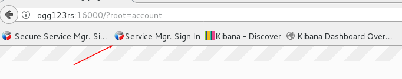

# One Way Replication Demo and Config

As noted in the readme document, labs 1 - 5 in the [Oracle_GoldenGate_12c_HOL_Current.pdf](https://dgcameron.github.io/oggms/Oracle_GoldenGate_12c_HOL_Current.pdf) from the base image have already been done for you.  You may wish to walk through the creation of deployments in that document.  Note that all the GG product path references (eg: /opt/app/oracle/product/12.3.0.1...) will be /opt/app/oracle/product/18.1... to reflect an upgrade to 18.1.

- Start the database.  Open a terminal window and enter:
    - `/home/oracle/Desktop/Scripts/startup.sh`

- Start services: `/opt/app/oracle/gg_deployments/ServiceManager/bin/startSM.sh` (disregard the message saying the service could not be started)

- Start Firefox (top manu) and log in using the shortcut.

- Configuration
    - `/opt/app/oracle/gg_deployments/ServiceManager` (userid/pw oggadmin / welcome1)
    - `/opt/app/oracle/gg_deployments/Atlanta_1` (source)
        - Admin Server:         16001
        - Distribution Server:  16002
        - Receiver Server:      16003
        - Metrics Server:       16004
    - `/opt/app/oracle/gg_deployments/Sanfran_1` (target)
        - Admin Server:         17001
        - Distribution Server:  17002
        - Receiver Server:      17003
        - Metrics Server:       17004

- Run through the following labs in the HOL document noted above.
    - Lab 6 - Configure Swingbench Schemas
    - 7a - Configure Uni-Directional Replication Integrated Extract)
    - 7b - Configure Uni-Directional Replication Distribution Server)
    - 7c - Configure Uni-Directional Replication Receiver Server)
    - 7d - Configure Uni-Directional Replication Integrated Replicat)

