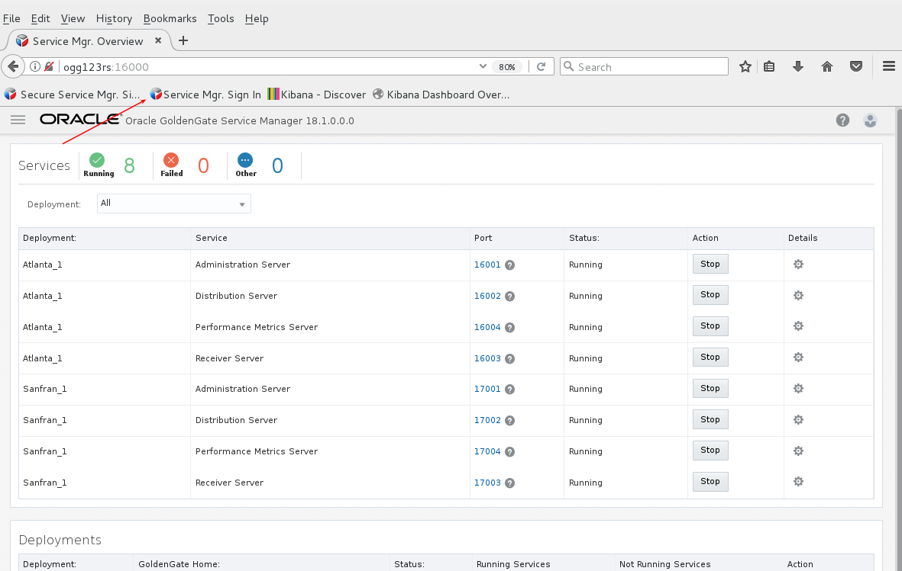
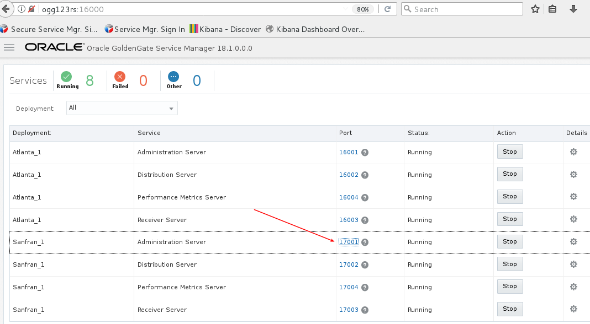
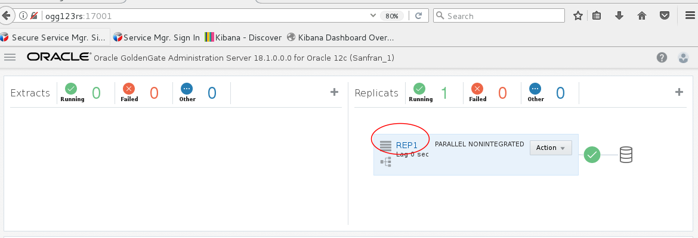
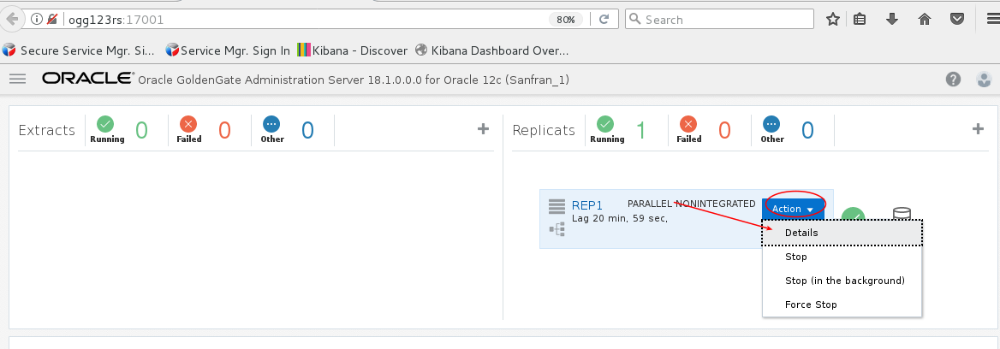
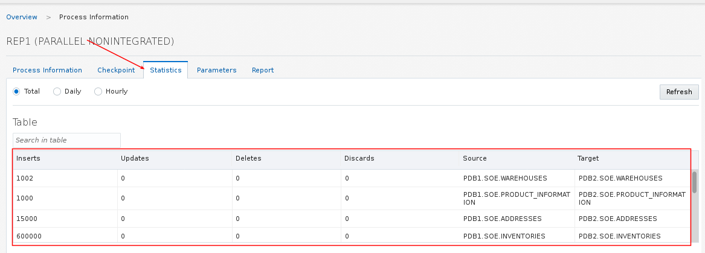
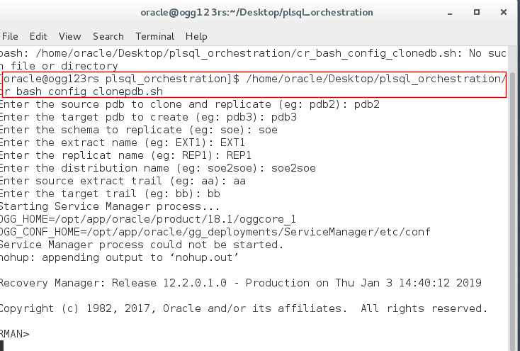

# Script PDB Cloning and Replication

As noted in the readme document, labs 1 - 5 in the [Oracle_GoldenGate_12c_HOL_Current.pdf](https://dgcameron.github.io/veridata/Oracle_GoldenGate_12c_HOL_Current.pdf) from the base image have already been done for you in the .  You may wish to walk through the creation of deployments in that document.  Note that all the GG product path references (eg: /opt/app/oracle/product/12.3.0.1...) will be /opt/app/oracle/product/18.1... to reflect an upgrade to 18.1.

## **Create the configuration with shell scripts**

- Start the database.  Open a terminal window and enter:
    - `/home/oracle/Desktop/Scripts/startup.sh`

- Start GG services:
    - `/opt/app/oracle/gg_deployments/ServiceManager/bin/startSM.sh` (disregard the message saying the service could not be started)

- If you have completed the one way replication lab then skip this step, otherwise run the following to complete the gg configuration.
    - `/home/oracle/Desktop/api/cr_bash_config.sh`

- Start firefox, log into GG, and confirm services are configured and running.







- Run swingbench and generate transactions.  See lab 6 in the HOL document for detailed steps.
    - `/opt/app/oracle/product/swingbench/bin/oewizard`

- Review replicat statistics to confirm the data has been replicated.





- If you wish to remove the configuration using a script you can run the following (or alternatively use the UI and remove the configuration manually):
    - `/home/oracle/Desktop/api/drop_bash_config.sh`

## **Clone a PDB, generate goldengate configuration, and start replication**

Note that if you must specify a NEW pdb as a target or you will get an error when trying to clone.  The image has been bundled with pdb1 and pdb2, and both have soe shemas that have now rows, unless you have run swingbench previously as part of other labs.

- Start the database.  Open a terminal window and enter:
    - `/home/oracle/Desktop/Scripts/startup.sh`

- Start GG services:
    - `/opt/app/oracle/gg_deployments/ServiceManager/bin/startSM.sh` (disregard the message saying the service could not be started)

- If you have completed the one way replication lab then skip this step, otherwise run the following to complete the gg configuration in a terminal window.  Since pdb1 and pdb2 already exist the script has defaults to clone pdb2 to pdb3.  You can override these defaults, and can also run this more than once, replicating multiple pdbs.
    - `/home/oracle/Desktop/api/cr_bash_config_clonepdb.sh`



- Start firefox, log into GG, and confirm services are configured and running.


- Run swingbench and generate transactions.  Be sure to select your source pdb (use pdb2 if you took the defaults above).  See lab 6 in the HOL document for detailed steps.
    - `/opt/app/oracle/product/swingbench/bin/oewizard`

- Review replicat statistics to confirm the data has been replicated.


- Following this lab you may wish to drop the new pdb.  You can use the following to do this:
```
sqlplus sys/welcome1 as sysdba
select name from v$containers;
alter pluggable database pdb3 close immediate;
drop pluggable database pdb3 including datafiles;
```

- Since we are allowing you to create any new pdb there is no script to remove the gg configuration.  You can use the ui to do this.