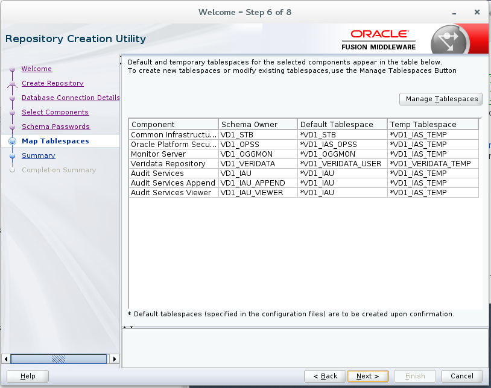
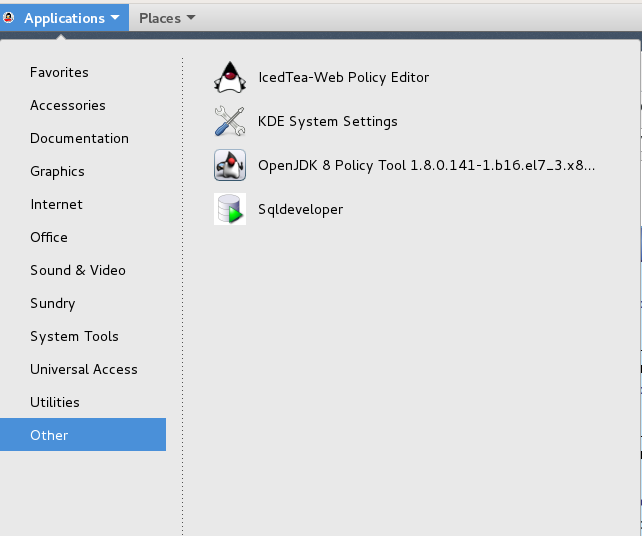

# Veridata Demo and Install and Configuration

This install was done as a build add-on to the OGG123RS_PDBS_HOLBASE VM image that was built to demo GoldenGate Microservices 12.1.3.  Note this is a rough guide - not all steps were captured in detail.

## **Demo Veridata**

- VM Login:  `oracle/welcome1`

- Start the database:  `/home/oracle/Desktop/Scripts/startup.sh`

- Start the Weblogic Admin Server: `/opt/app/oracle/product/fmw/user_projects/domains/base_domain/startWebLogic.sh (weblogic/admin when prompted)`  **DO NOT CLOSE THE WINDOW**

- Start the Weblogic Managed/Veridata Server: `/opt/app/oracle/product/fmw/user_projects/domains/base_domain/bin/startManagedWebLogic.sh VERIDATA_server1 http://127.0.0.1:7001 (weblogic/admin when prompted)` **DO NOT CLOSE THE WINDOW**

- Start the source pdb1 Veridata agent: `/home/oracle/agent/agent.sh start /home/oracle/agent/agent.properties`

- Start the target pdb2 Veridata agent: `/home/oracle/agent2/agent.sh start /home/oracle/agent2/agent.properties`

- Log into Weblogic Console:  `http://127.0.0.1:7001/console (weblogic/welcome1)`

- Log into Veridata:  `http://127.0.0.1:8830/veridata (weblogic/welcome1)`.  See Step 10 below in the Install Steps for schema compare examples.

## **Install and Configure Veridata**

### **Step 1 - Download HOLBASE VM**

Location of OGG123RS_PDBS_HOLBASE VM (in Retriever/ff-ftp.us.oracle.com, must be on VPN to download)

[OGG123RS_PDBS_HOLBASE](http://retriever.us.oracle.com/apex/f?p=121:22:7096965570613831::NO:RP:P22_CONTAINER_ID,P22_PREV_PAGE:81018,5425609)

### **Step 2 - Download Software**

- Here are the software versions.

- log into [Edelivery](https://edelivery.oracle.com/osdc/faces/Home.jspx_) and download version 12.2.1.2.0 

- Download [JDK](https://www.oracle.com/technetwork/java/javase/downloads/jdk8-downloads-2133151.html)

- Download [SQL Developer](https://www.oracle.com/technetwork/developer-tools/sql-developer/downloads/index.html) (not necessary, but convenient)

### **Step 3 - Install JDK and SQL Developer**

- SCP the files to the running image and install JDK (`sudo rpm -ivh jdk-8u191-linux-x64.rpm`)

- Unzip SQL Developer

- Optional - add SQL Developer to the desktop menu.

- Start SQL Developer (`/home/oracle/sqldeveloper/sqldeveloper.sh`).  Enter the jdk path `/usr/java/jdk1.8.0_191-amd64`.

### **Step 4 - [Install Fusion Middleware](https://docs.oracle.com/middleware/12212/lcm/INFIN/GUID-943F11B4-DD9E-4631-8F5F-80B3ADC06F26.htm#INFIN125)**

- I installed into `/opt/app/oracle/product/fmw`, since the database and OGG was already install in /opt.

### **Step 5 - [Install Veridata](https://docs.oracle.com/goldengate/v12212/gg-veridata/GVDIS/title.htm)**

- Select oracle home `/opt/app/oracle/product/fmw`.

### **Step 6 - Create Repository with RCU**

- run `/opt/app/oracle/product/fmw/oracle_common/bin/rcu`

### **Step 6 - Create New Veridata Domain**

- run `/opt/app/oracle/product/fmw/oracle_common/common/bin/config.sh`

### **Step 7 - Start WLS Admin and Veridata Servers and Login to the Console**

### **Step 8 - Configure the Agent**

- First lets set the java home so we don't have to keep setting it in new terminal windows.

- Now configure two agents - one for the source pdb1 database and the other for the target pdb2 database (replicating soe schema).

### **Step 9 - Add Veridata priviledges to Weblogic user.**

### **Step 10 - Log into Veridata and configure compare jobs.**

- [User Guide](https://docs.oracle.com/goldengate/v1221/gg-veridata/GVDUG/title.htm)

